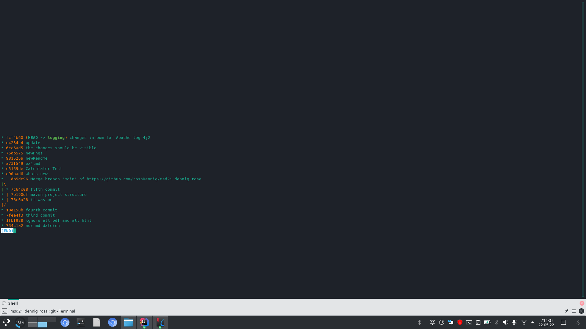
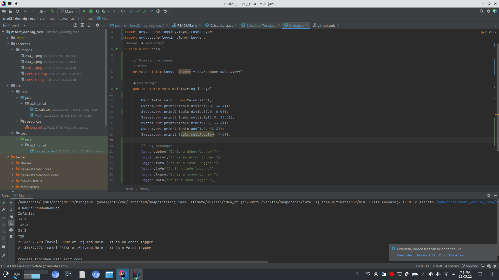
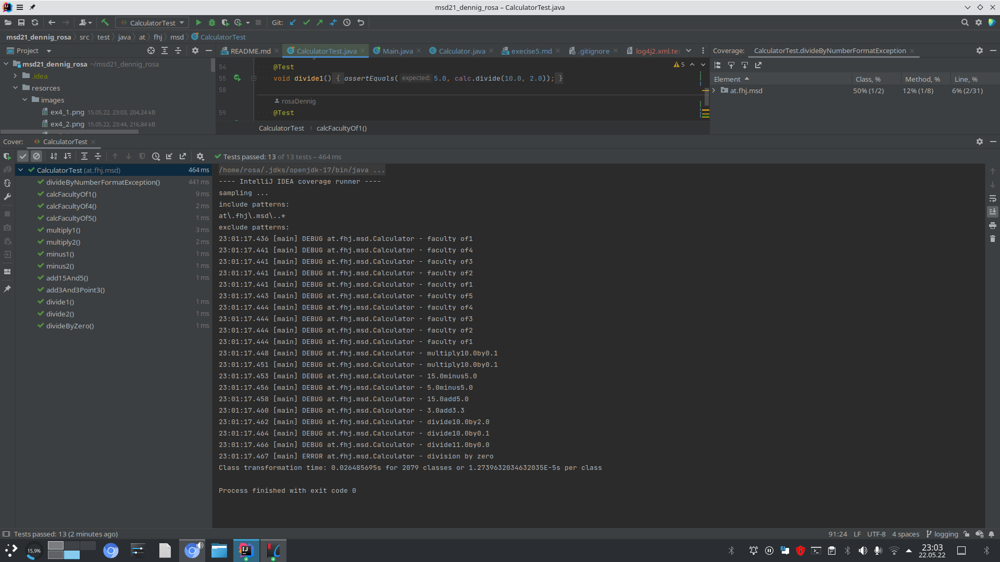
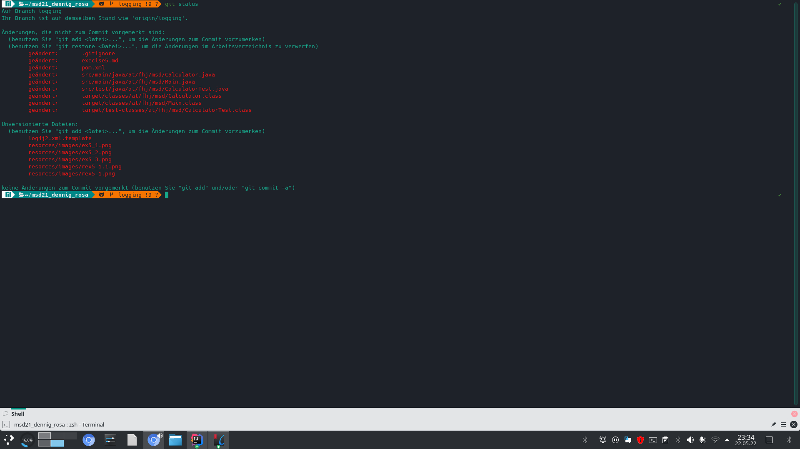

### steps in exercise 5
#### create a new branch logging
```
with git branch -Switch to the logging branch via git checkout
with  git log --graph --decorate --oneline the banches are visible
```
#### dependencies added to the pom.xml
```
<dependencies>
  <dependency>
    <groupId>org.apache.logging.log4j</groupId>
    <artifactId>log4j-api</artifactId>
    <version>2.17.2</version>
  </dependency>
  <dependency>
    <groupId>org.apache.logging.log4j</groupId>
    <artifactId>log4j-core</artifactId>
    <version>2.17.2</version>
  </dependency>
</dependencies>

```

#### create  a Maven project with Log4j2 dependency
```
 
-make a Logger  and -Use INFO and ERROR levels to log 
-by default Log4j assigns the root logger to Level.ERROR
those logs will be printed on the standard console.
-ALL < TRACE < DEBUG < INFO < WARN < ERROR < FATAL 
Because the default level is set to ERROR, error and fatal will be logged.
```


#### why logging?
```
while running tests, with logging everthing thats going on is traceable 
in the log data you can see when a test failed where and why? 
Five standard log4j levels:
DEBUG Level. This log4j level helps developer to debug application. ...
INFO Level. This log4j level gives the progress and chosen state information. ...
WARN Level. This log4j level gives a warning about an unexpected event to the user. ...
ERROR Level. ...
FATAL Level. ...
Configuration possibilitys  log4j:
-default -Automatic configuration -Additivity
```


