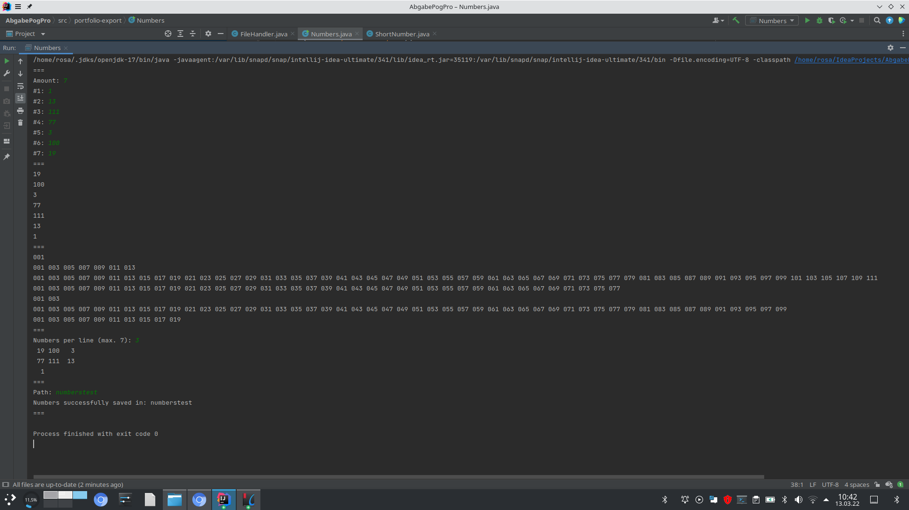

```
a picture
```

## Picture of the console after a test run of Numbers




```


a link
```
[Strandard](https://www.derstandard.at/)

```


some headlines and paragraphs
```

# Day 1
The sky above the port was the color of television,    
tuned to a dead channel.

It was a bright very cold day in March,  
and the clocks had all stopped.

## Day 2 
We were all still trying to wake up but,   
it didn't seem to work.

### Day 3
The situation has not changed,  
we are still trying to wake up.

#### Day 4
Today we heard a very loud noise,  
it seamed to have come from the other side of the port.

We believe by now that,  
we have all been awake for the last for days.

We just haven't found out yet how to turn the clocks back on!


