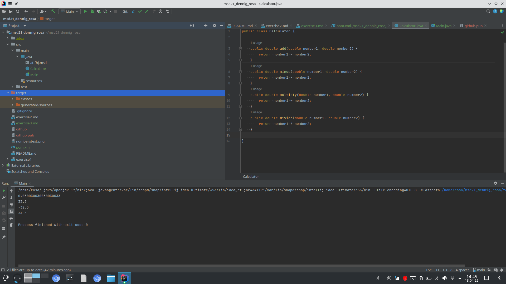
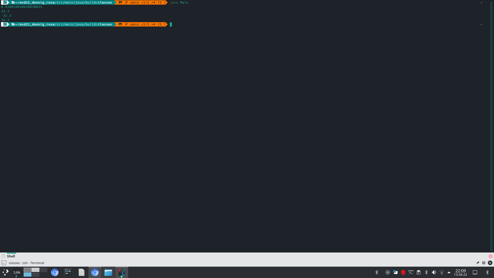

### steps in exercise 3

```
I installed Maven with:

sudo pacman -S maven 
  
```
```

I created a new project in IntelliJ named msd21_dennig_rosa

I added .idea to gitignore

I created a java class called at.fhj.msd.Calculator

with the following methodes:

public double add(double number1, double number2)

public double minus(double number1, double number2)

public double multiply(double number1, double number2)

public double divide(double number1, double number2)

I created a java class at.fhj.msd.Main
after I called the at.fhj.msd.Main I could see a new target folder

```



```
with mvn compile I build my demo example

with javac at.fhj.msd.Main.java -d build/classes 

I compiled the at.fhj.msd.Main and the at.fhj.msd.Calculator Class

```



```

with java at.fhj.msd.Main I run the main methode

```
