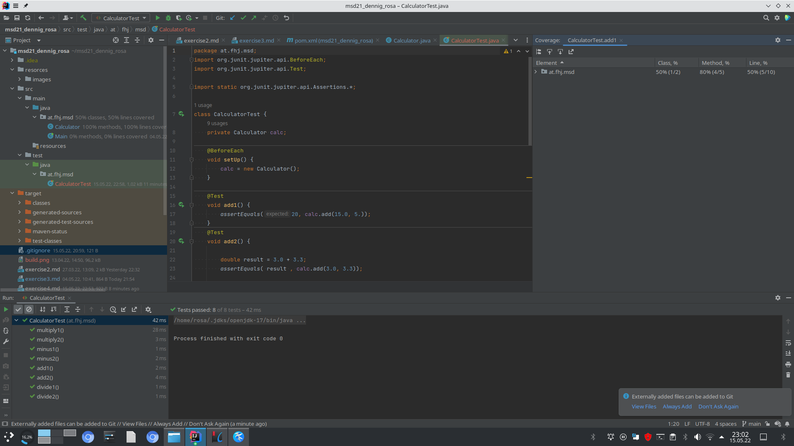
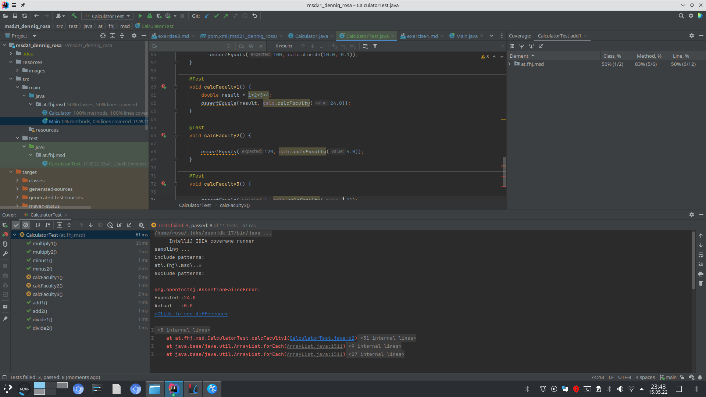

### steps in exercise 4

```
I added new dependencies to pom.xml, (from the exercise4 sheet) to be able to make UnitTests;
It didn't work.
I added:

    <dependencies>
    <dependency>
        <groupId>org.junit.jupiter</groupId>
        <artifactId>junit-jupiter-api</artifactId>
        <version>5.8.2</version>
        <scope>test</scope>
    </dependency>
    </dependencies>
    
It seams to work.    

  
```
```

I created a java class called at.fhj.msd.CalculatorTest 

I added *.target and *.build to gitignore


I created two test cases for the following methodes:

public double add(double number1, double number2)

public double minus(double number1, double number2)

public double multiply(double number1, double number2)

public double divide(double number1, double number2)

I tested the cases with assertEquals( , ) , with assertNotEquals( , ) and with assertTrue( , ) cases.


```
# 1.CalculatorTest Cases


```

I created three test cases for the following methode:

public static long calcFaculty(long n) 

```

# 2.CalculatorTest Cases for calcFaculty that failed


