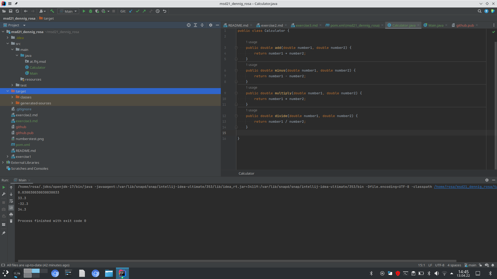

### steps in exercise 4

```
I added new dependencies to pom.xml, (from the exercise4 sheet) to be able to make UnitTests;
It didn't work.
I added:


  
```
```

I created a java class called at.fhj.msd.CalculatorTest 

I added *.target and *.build to gitignore


I created two test cases for the following methodes:

public double add(double number1, double number2)

public double minus(double number1, double number2)

public double multiply(double number1, double number2)

public double divide(double number1, double number2)


```

