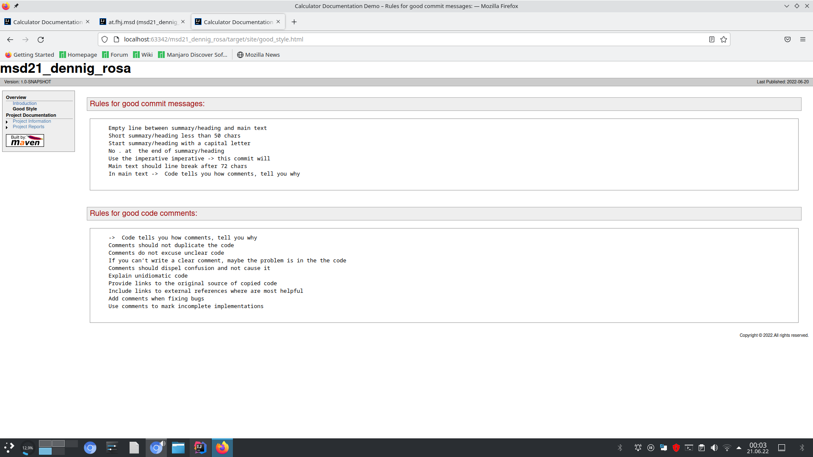
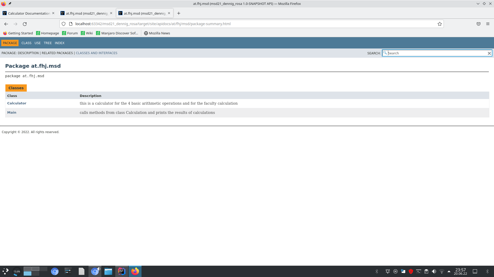
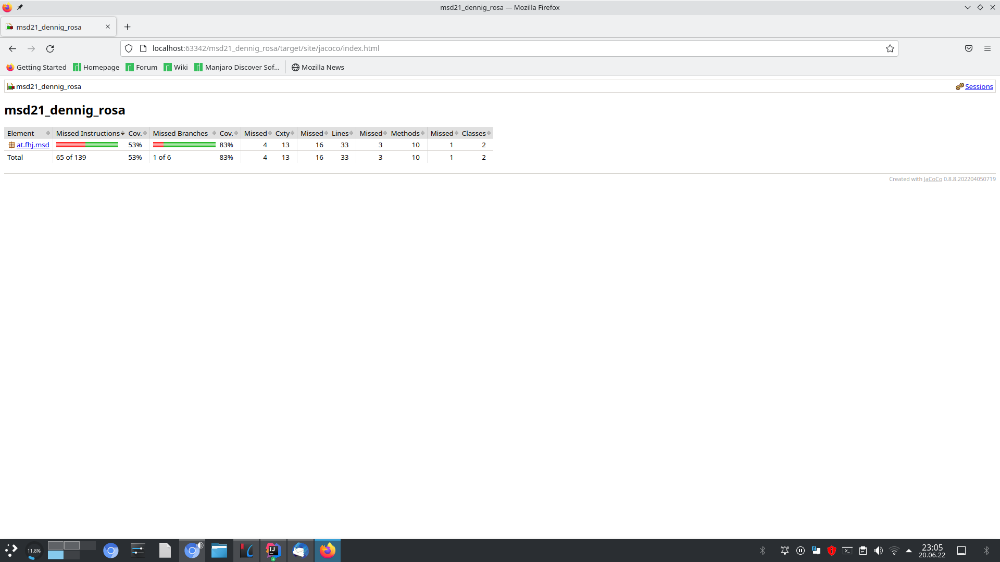

### steps in exercise 6
#### documentation


#### Was ist notwendig um Maven Site Dokumentation zu generieren?
```
Create a site
Generate the site
Deploy the site
Create a site descriptor
Add extra resources
Configure reports
```


#### Welche unterschiedlichen Aspekte, Konfigurationen, Informationen, usw. werden in site.xml bzw. pom.xml konfiguriert?
```
site.xml:
defines the directory structure of the website and the navigation bar with links to other sites.
pom.xml:
configures plugins:
maven compiler
junit for testing
jacoco reports about tests
maven site to create the website
log4j  for logs
javadoc for javadoc in the website
```
good_style

Javadoc API - help

JUnit -Testauswertung
